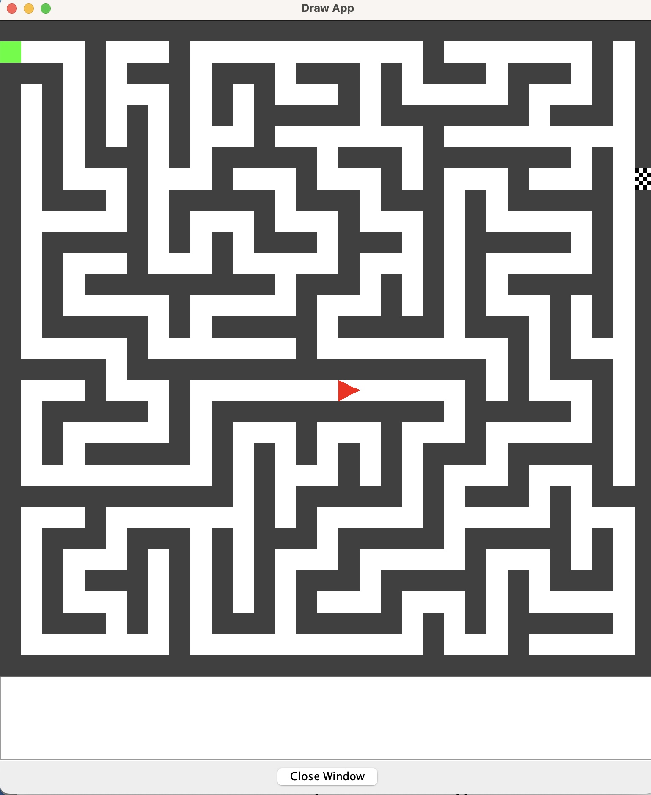

# C Coursework

This program displays a random computer generated maze from the array "maze". It always starts the maze at the top left corner (indicated by a green square) and the end of the maze is randomly chosen to be somewhere along the right side (shown by a flag print). The program then solves the maze and the solved path is stored in the array "solution".  It then displays a robot (a green arrow) which moves through the maze along the solved path changing direction with each turn until it reaches the finishing flag.

## Files

There are four C files and one Header file:

1. main.c
    * This file is the main file of the program. It contains the main function. This function calls two functions: the drawBackground() function which draws the randomly generated maze as the background, and the move() function which solves the maze and then moves the robot around the maze in that direction.
2. maze.c
    * This file creates the maze by randomly going through the maze array and changing its position to 1 until it gets stuck. This would happen if it hits the walls or itself. It adds where it has been to a linked list used as a stack. When it gets stuck it pops the top of the stack and tries the new top's postion to see if it can move further. It does this until all positions have been tried using recursion. We now have an array with the maze. Each element in the arrays represents a maze square. It is  0 if it is a wall (gray) and 1 if it is the path (white).
3. draw.c
    * This file simply draws the maze. It has a seperate function to display the flag. This is to generalise the flag drawing if one wanted to reuse that image for something else.
4. robot.c
    * This file solves the maze using a recursion algorithm. Where it goes through the maze until it finds the finish, but when it gets stuck it backs up to the last available place and tries from there. It then draws the robot as a triangle facing the direction it is heading in along the path it has just found.
5. global.h
    * This is the header file. Here I declare all the declarations of the functions and macro definitions to be shared between the source files. I declare the two 2D arrays (maze and solution) with the sizeX and sizeY which can be changed to any dimensions (where sizeX and sizeY are > 5). Each element in the arrays represents a maze square.

## Use

To use this program you can edit in the global.h file the sizeX and sizeY (they need to be greater than 5) to change the dimensions of the maze. Then in the terminal yopu need to run the following commads:
```
gcc -o main main.c graphics.c robot.c maze.c draw.c
```
Followed by:
```
./main | java -jar drawapp-2.0.jar
``` 
You also need to have the graphics.c, graphics.h and drawapp-2.0.jar files in the same directory for it to work.


This is what the program should look like:
